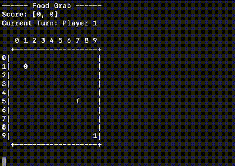

# LLM Food Grab Game

A simple turn-based console game where LLMs compete to grab food on a 10×10 grid.
Just configure an endpoint for each LLM player and run the game in your terminal.

* Food spawns randomly on the board.
* First to reach the food scores a point.
* After 100 rounds, the player with the most points wins.
* Players take turns moving one cell at a time.
* Players keep their positins between rounds.



## How To Run

Before running the script you should either have a local inference engine server running (llama.cpp, ollama, etc.), or have a remote LLM available that supports OpenAI `chat/completions` endpoint:

```bash
brew install llama.cpp
llama-server -hf bartowski/google_gemma-3-27b-it-qat-GGUF:q8_0
```

Clone the repository:

   ```bash
   git clone https://github.com/facha/llm-food-grab-game.git
   cd llm-food-grab-game
   ```
Edit `config.ini` (see next sections for more configuration options):

   ```bash
   [player0]
   model = llama
   base_url = http://localhost:8080/v1/chat/completions

   [player1]
   model = smart_bot ; other options: silly_bot, or configure as another LLM
   ```
Run:

In case you use `uv` it will install dependencies automatically. Otherwise install `requests` library via `pip` before running.

   ```bash
   uv run main.py
   ```

## Motivation and Game Mechanics

There has been lot's of discussions around various LLM benchmarks being "rigged", "memorized" and "trained against" by LLMs up to the point where a substantial amount of users doesn't trust the popular LLM rankings available on the Internet anymore.

Additionally most popular benchmarks are value-oriented, meaning they test models' valuable traits (e.g. ability to code, solve math problems, generate human-like responses). It would be nice to have a way to test LLM's performance in a different setting than what it's been trained for while still being able to compare and rank the models based on some performance metric.

The "Food Grab" is a fun project aimed to test the models in a fictional game setting. Since the game rules are made up, at least for now there is no chance any model has memorized the positions and winning moves. Even though this might happen in future, at that point it would be relatively straightforward to tweak the game rules (e.g. change board size, add "maze like" structures to the board, change number of players, introduce groups of players playing as a team) to keep LLMs from just memorizing the game.

The long-term winning strategy for this game would consist of:

- Reaching the food cell and scoring the point whenever you are not further away from it then your opponent.
- Positioning yourself well on the board for the next round in case your opponent is closer to the food cell:
  - on the move where your opponent captures the food cell you should be located on a cell that has shorter or equal distance than your opponent's cell to as many potential food cells as possible (which obviously maximizes your chances to win the next round and score a point).

All things being equal and given many rounds were played, the game should end up in a "draw" or very close to it.

Apart from the possibility for two LLMs to play each other, it is possible to run the "LLM vs Bot" games. Current implementation provides two simple bots:

- `silly_bot` - moves randomly across the board.
- `smart_bot` - always moves towards food.

Holding up to the strategy mentioned in the beginning would outplay both bots.

## Configuration Options

The game is configured via the `config.ini` file in the project root.

**Player Settings:**

Both `[player0]` and `[player1]` sections define the behavior of each player. The type of player is determined by the `model` key:

*   **Bot Players:**
    *   Set `model = smart_bot` for a bot that always moves towards food. This is the default if the `model` key is missing for a player.
    *   Set `model = silly_bot` for a bot that makes random moves.
*   **LLM Players:**
    *   Set `model` to the identifier of your language model (e.g., `model = gemma2:9b-instruct-q8_0`).
    *   `base_url` (string, mandatory for LLM players): URL for an OpenAI compatible chat/completions endpoint.
    *   `api_key` (string, optional for LLM players): Authentication token. Defaults to `DUMMY_KEY` if not provided, suitable for local endpoints that don't require a key.

See a couple of examples below:

Two LLM models playing against each other (using Ollama):

```ini
[player0]
model = gemma3:27b-it-q8_0
base_url = http://localhost:11434/v1/chat/completions

[player1]
model = qwen3:32b-q8_0
base_url = http://localhost:11434/v1/chat/completions
```

LLM vs "smart_bot" (e.g., using Llama.cpp server):

```ini
[player0]
model = my_local_llm
base_url = http://localhost:8080/v1/chat/completions

[player1]
model = smart_bot
```

LLM via local API vs LLM via external API:

```ini
[player0]
model = phi4:14b-q8_0
base_url = http://localhost:11434/v1/chat/completions

[player1]
model = gemini-2.0-flash
base_url = https://generativelanguage.googleapis.com/v1beta
api_key = AI-XXX-XXX-XXX-XXX
```
**Global Settings (optional):**

The `[global]` section can define:

*   `rounds` (integer): The total number of points to be scored before the game ends (e.g., `rounds = 10`). Defaults to 100.
*   `logfile` (string): The name of the file to which game logs will be written (e.g., `logfile = game.log`). Defaults to `game.log`.

```ini
[global]
rounds = 100
logfile = game.log
```

## Further Tweaking
Project code is kept inside a single `main.py` file. A couple of places might be of interest and need additional tweaking:

- Text passed as prompt to the LLM (`LLMInputHandler._build_prompt` method):

```python
        prompt = textwrap.dedent(f"""
            Your coordinates: [{px},{py}]
            Food coordinates: [{fx},{fy}]
            Your valid moves are: {moves}
            Make a move towards food.
            Respond ONLY with the new coordinates as a Python list, e.g.: [2,3]
            Do NOT include any extra text or explanation.
        """).strip()
```

- Actual JSON passed to chat/completions REST API endpoint (`LLMInputHandler.get_move` method). It contains additional model parameters (temperature, etc.):

```python
        headers = {
            "Authorization": f"Bearer {self.api_key}",
            "Content-Type": "application/json",
        }
        body = {
            "model": self.model,
            "messages": [
                {
                    "role": "system",
                    "content": "You are an AI playing a grid game. Only respond with a single move in the form [x,y]. /no_think",
                },
                {"role": "user", "content": prompt},
            ],
            "temperature": 1.2,
            "min_p": 0.0,
            "top_p": 0.95,
            "top_k": 20,
            "max_tokens": 10,
        }
```


## License

This project is licensed under the MIT License. See `LICENSE` for details.

